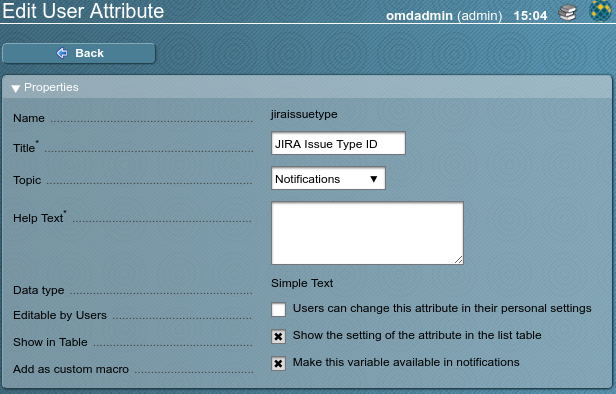

# Description #

The JIRA notification plugin talks to a JIRA instance via its API to create issues when notifications are created. It closes the issue as soon as the monitered state is OK again.

To do this it needs two custom fields in the issue type that gets used:

* `monitoring-host` for the hostname
* `monitoring-service` for the service description

If both custom fields do not exist, the automatic issue resolution will not work.

# Prerequisites #

The notification plugin needs the JIRA Python module. This module has to be installed by running

    pip install jira

as the site user. This will install a number of Python modules.

# Documentation #

The JIRA notification plugin uses several environment variables set by the accompanying WATO plugin or set by custom user attributes. I.e. you can have different monitoring users creating issue in different JIRA projects.

`NOTIFY_PARAMETER_*` variables are set in the notification rule by the WATO plugin, `NOTIFY_CONTACT_*` variables are set from user custom attributes that have to be configured to be used in notifications.

The custom user attributes should be defined as this:

 

## `NOTIFY_PARAMETER_URL` ##

This contains the JIRA base URL. It is set for each notification rule, i.e. you can create issues in different JIRA instances with multiple notification rules.

## `NOTIFY_PARAMETER_USERNAME` ##

This is the JIRA API username for authentication.

## `NOTIFY_PARAMETER_PASSWORD` ##

This is the JIRA API password for authentication.

## `NOTIFY_PARAMETER_PROJECT` or `NOTIFY_CONTACT_JIRAPROJECT` ##

The numerical JIRA project ID. If not set, it will be retrieved from a custom user attribute named `jiraproject`. If that is not set, the notification will fail.

## `NOTIFY_PARAMETER_ISSUETYPE` or `NOTIFY_CONTACT_JIRAISSUETYPE` ##

The numerical JIRA issue type ID. If not set, it will be retrieved from a custom user attribute named `jiraissuetype`. If that is not set, the notification will fail.

## `NOTIFY_PARAMETER_PRIORITY` or `NOTIFIY_CONTACT_JIRAPRIORITY` or not set ##

The numerical JIRA priority ID. If not set, it will be retrieved from a custom user attribute named `jirapriority`. If that is not set, the standard priority will be used.

## `NOTIFY_PARAMETER_RESOLUTION` or `NOTIFY_CONTACT_JIRARESOLUTION` ##

The numerical JIRA resolution transition ID. If not set, it will be retrieved from a custom user attribute named jiraresolution.

## `NOTIFY_PARAMETER_USERNAME` or `NOTIFY_CONTACT_JIRAUSER` ##

## `NOTIFY_PARAMETER_MONITORING`
